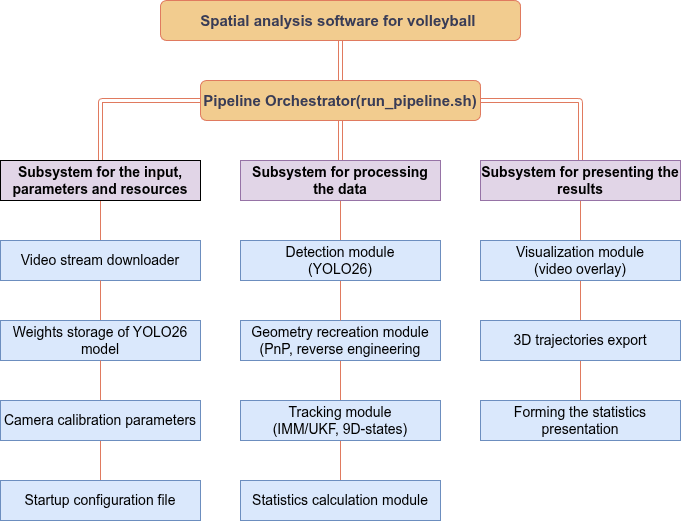
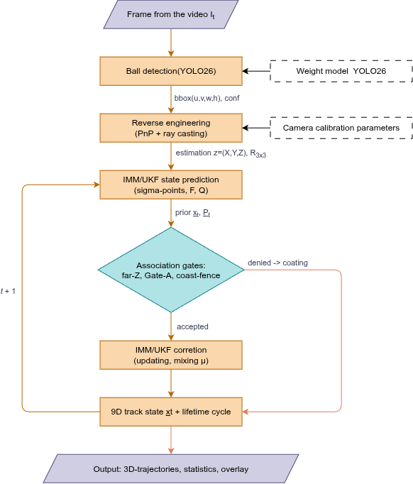

# 3D Volleyball Tracking & Analysis System
## 1. Introduction
This is my first major project in the Data Science field which is concentrated around getting the most information out
of video footage of a resolution and FPS number below a certain point - in this case 1920x1080 with 50 FPS was used to
get out of them information about 3D-space coordinates of volleyball ball during the rounds within 1 game of volleyball.


## 2. The problem to be solved
In the amateur volleyball leagues and matches it is common to have difficulties with post-game analysis, because
it is really complicated and expensive to have some decent tracking systems on the level, where you can't really make a 
living on small kind of prize money from even a winning a tournament, so it is hard to get more information for the 
furthemore progress of your technique, game sense, power, etc.

## 3. Solution
This project/system is the fundamental part of the whole idea to make post-analysis of the game easier, explore the 
limitations of 1, 2 or more cameras with the amateur parameters which comes with a cheaper price and potentially make 
the judging process a bit quicker, more effective and fair.

## 4. Key features
It is a mix of YOLO2026M fine-tuned model for better detection of volleyball and a new branch/modification of Kalman 
filter for non-linear behavior of ball in the air and the game itself - Unscented Kalman Filter(UKF) combined with extra
layers of different track-observations(the intervals where the ball was in play) and different behavioral patterns:
spike, rebound, floor touch.

## 5. Pipeline Architecture
The system processes video frames through a hybrid computer vision and mathematical filtering pipeline:
1. Object Detection (YOLO26m): The fine-tuned model scans the frames and extracts 2D bounding boxes of the ball, 
maintaining high FPS.
2. 3D Ray Casting & Camera Calibration: Using solvePnP and the physical diameter of a volleyball, the system transforms 
flat 2D pixel coordinates into real-world 3D coordinates (in meters), matching the court's physical space.
3. Data Association (Custom 3D ByteTrack): Instead of using standard 2D IoU (which fails when 3D depth is involved), the 
tracker uses Mahalanobis distance. This successfully filters out false positives (like players' shoes) by statistically 
rejecting detections that are too far from the predicted physical trajectory.
4. State Estimation (IMM-UKF): The core engine. It uses the Interacting Multiple Model (IMM) to switch between different 
physical states (Ballistic flight, Spike/Hit, Floor Bounce). Inside it, the Unscented Kalman Filter (UKF) smooths the
trajectory by calculating non-linear aerodynamic drag, keeping the track alive and physically accurate even when the
ball is temporarily blocked by players (occlusions).
5. Analytics & Visualization: The final smoothed 3D coordinates are used to calculate real speed (km/h) and generate 
interactive 3D plots of the game.

### Scheme for spatial analysis software
<p align="center">
    
</p>

### Block scheme for system pipeline
<p align="center">
    
</p>

## 6. Installation & Quick Start
Prerequisites:
* Operating System: Linux (Ubuntu) or Windows 10/11
* Python 3.11+
* Anaconda / Miniconda
* Recommended: CUDA-enabled GPU (NVIDIA RTX 3060 or higher) for real-time YOLO inference.

1. **Clone the repository:**

```
git clone https://github.com/your-username/volleyball-3d-tracking.git
cd volleyball-3d-tracking
```


2. **Create and activate the Conda environment:**

To ensure full reproducibility and avoid conflicts, it's highly recommended to use Anaconda:

```
conda create -n Volleyball_diploma python=3.11 -y
conda activate Volleyball_diploma
```


3. **Install dependencies:**
Install the core libraries (OpenCV, FilterPy, Ultralytics, etc.) via the requirements file:

```
pip install -r requirements.txt
```


Note: If you have a CUDA-enabled GPU, make sure to install the PyTorch version optimized for your CUDA version (e.g., CUDA 12.1) to achieve maximum tracking FPS:
```
pip install torch==2.4.1 torchvision==0.19.1 --index-url https://download.pytorch.org/whl/cu121
```

4. **Run the tracking pipeline:**
The project features a fully automated bash script that encapsulates the entire pipeline (detection, tracking, statistics computation, and video overlay generation).

Make sure you have your trained weights (main_model_april.pt) placed in the training_models/models/ directory, then run:
```
bash scripts/run_pipeline.sh path/to/your/video.mp4 my_experiment
```

This will process the video and generate the output artifacts (3D tracks, statistics JSON, and the rendered overlay video) inside the runs/ directory.

_Optional:_ For exploratory analysis, step-by-step debugging, and visualization, you can also use the interactive Jupyter Notebook:
```
jupyter notebook ball_3d_analysis/IMM_UKF_modeling.ipynb
```

## 7. Future work
For the next level and upgrade of this project I'm going to shift from monocular system to stereoscopic system, where I
expect to get far better results for Z-axis estimation. Also, I'm planning to "refine" my data, because I've noticed and
addapted my system to this defect where even though my detection model rightly finds the object - unfortunately it sets 
the boundaries of this same object in the totally different manner depending on the scale and position of object, which 
has been crucial obstacle for getting at least "decent" results with this part of the project.

## 8. Contacts for more clarification
_Email:_ romanbezhhh@gmail.com\
_LinkedIn:_ https://www.linkedin.com/in/roman-bezshchasnyi-84286a319